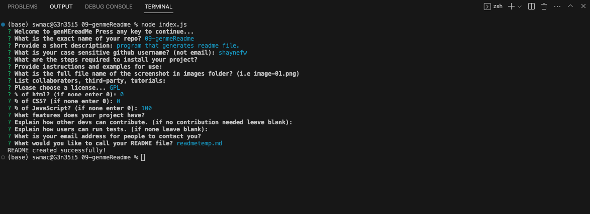

# 09-genmeReadME

## Description

readme generator

## Table of Contents

- [Installation](#installation)
- [Usage](#usage)
- [Credits](#credits)
- [License](#license)
- [Contact](#questions)

## Installation

[Project repo](https://github.com/shaynefw/09-genmeReadME)
[Project deployed link](https://shaynefw.github.io/09-genmeReadME/)

Additional steps: 

## Usage

## Credits

## License 

This project is licensed under the MIT license. You can find more information by clicking the following badge: .

## Badges

## Features

## How to Contribute

## Tests

## Questions

If you have any questions you can reach me by email at .
